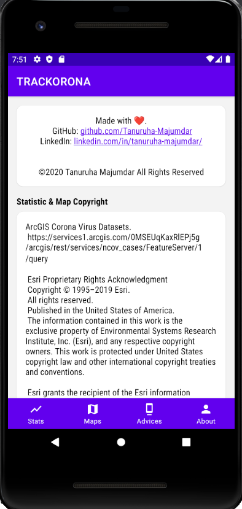
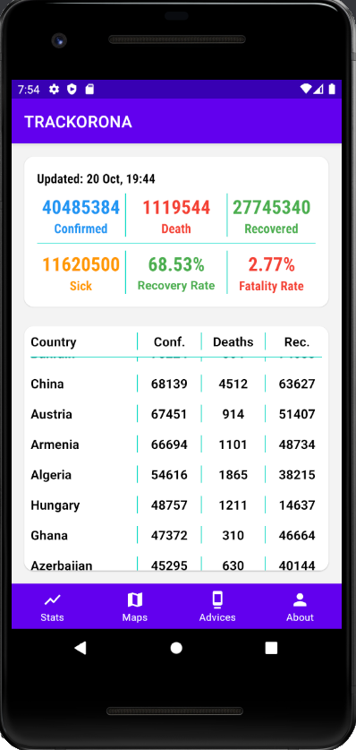
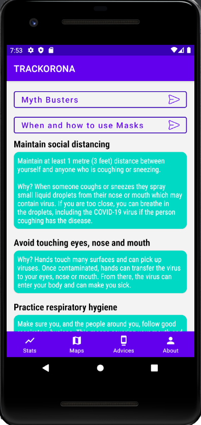

# TRACKORONA - Corona Virus Tracker & Advices Android App with Kotlin Application:

## Features
- Current statistics of global total confirmed, deaths, recovered cases.
- Statistics of countries and regions total cases count
- Datasets is provided by ArcGIS Esri Corona Virus dataset.
- Basic advice to prevent and handle virus,  myth busters Q&A from WHO.

<table>
        <tr>
            <td></td>
                <td></td>
            <td></td>
        </tr>
</table>
